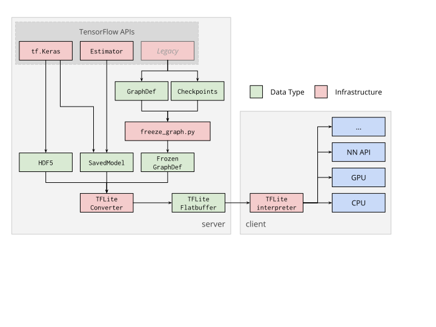

# TensorFlow Lite Converter

The TensorFlow Lite Converter converts TensorFlow graphs into
TensorFlow Lite graphs. There are additional usages that are also detailed in
the usage documentation.

## Usage documentation

Usage information is given in these documents:

*   [Command-line glossary](../g3doc/r1/convert/cmdline_reference.md)
*   [Command-line examples](../g3doc/r1/convert/cmdline_examples.md)
*   [Python API examples](../g3doc/r1/convert/python_api.md)

## Where the converter fits in the TensorFlow landscape

Once an application developer has a trained TensorFlow model, the TensorFlow
Lite Converter will accept
that model and generate a TensorFlow Lite
[FlatBuffer](https://google.github.io/flatbuffers/) file. The converter currently supports
[SavedModels](https://www.tensorflow.org/guide/saved_model#using_savedmodel_with_estimators),
frozen graphs (models generated via
[freeze_graph.py](https://github.com/tensorflow/tensorflow/blob/master/tensorflow/python/tools/freeze_graph.py)),
and `tf.Keras` model files.  The TensorFlow Lite FlatBuffer file can be shipped
to client devices, generally mobile devices, where the TensorFlow Lite
interpreter handles them on-device.  This flow is represented in the diagram
below.

